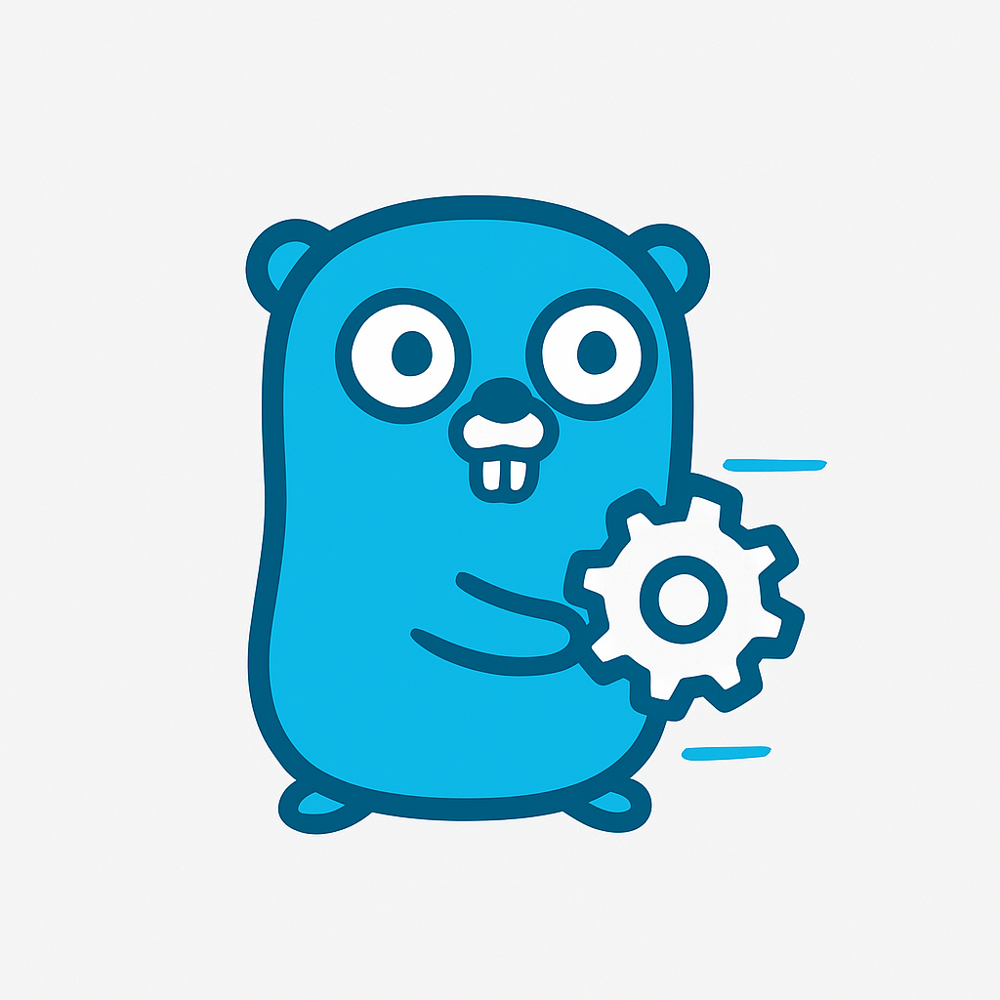

<style>
.logo { width: 50%; border-radius: 24px; }
</style>
<div align="center">
  
</div>

# go-easy-config

A lightweight configuration loader and validator for Go applications. Supports environment variables, command-line flags, and optional AWS Secrets Manager integration via secretfetch.

## Contents
- [Features](#features)
- [Installation](#installation)
- [Usage](#usage)
  - [Define Your Configuration Struct](#define-your-configuration-struct)
  - [Load and Validate Configuration](#load-and-validate-configuration)
  - [AWS Secrets Manager Integration](#aws-secrets-manager-integration)
  - [Customising Loaders and Validators](#customising-loaders-and-validators)
  - [Types of Configuration Sources](#types-of-configuration-sources)
  - [Loader Order and Customisation](#loader-order-and-customisation)
    - [Custom Loader Order Example](#custom-loader-order-example)
    - [ShortCircuitChainLoader (Optional Short-Circuiting)](#shortcircuitchainloader-optional-short-circuiting)
    - [Providing Your Own Chain Loader](#providing-your-own-chain-loader)
    - [Providing Your Own Loader](#providing-your-own-loader)
- [Validation](#validation)
  - [Advanced Validation](#advanced-validation)
- [Testing](#testing)
- [License](#license)

## Features
- Load configuration from environment variables
- Parse command-line flags
- Fetch secrets from AWS Secrets Manager (optional)
- Load configuration from INI, JSON, and YAML files or byte arrays
- Validate configuration using go-playground/validator
- Modular loader design for extensibility

## Installation

```shell
go get github.com/gymshark/go-easy-config
```

## Usage

### Define Your Configuration Struct

```go
package main

import (
	"github.com/gymshark/go-easy-config" // Core package including chain loaders and interfaces
	
	// (OPTIONAL) Import sub packagaes for custom loaders and validators
	"github.com/gymshark/go-easy-config/loader/aws" // Provides AWS specific loaders
	"github.com/gymshark/go-easy-config/loader/generic" // Provides generic loaders (environment, command-line, ini, json, yaml)
)

type AppConfig struct {
	Port int    `env:"PORT" clap:"port" validate:"required,min=1,max=65535"`
	Env  string `env:"ENV" clap:"env" validate:"required,oneof=dev prod"`
	Secret string `env:"SECRET" clap:"secret"`
}
```

### Load and Validate Configuration

```go
func main() {
	handler := config.NewConfigHandler[AppConfig]()
	var cfg AppConfig
	if err := handler.Load(&cfg); err != nil {
		panic(err)
	}
	if err := handler.Validate(&cfg); err != nil {
		panic(err)
	}
	// You can also use the LoadAndValidate method:
	if err := handler.LoadAndValidate(&cfg); err != nil {
		panic(err)
	}
	// Use cfg...
}
```

### AWS Secrets Manager Integration

To fetch secrets, add fields with the `secretfetch` tag and configure AWS credentials:

```go
type SecretsConfig struct {
	DBPassword string `secretfetch:"/prod/db/password"`
}

// You'll also need to implement the handler with the AWS Secrets Manager loader:
handler := config.NewConfigHandler[SecretsConfig](
	config.WithLoaders(aws.SecretsManagerLoader[SecretsConfig]{}, config.DefaultConfigLoaders()...),
)
```

### Customising Loaders and Validators

You can provide custom loaders or validators:

```go
handler := config.NewConfigHandler[AppConfig](
	config.WithValidator(customValidator),
	config.WithLoaders(customLoader),
)
```

### Types of Configuration Sources

#### Environment Variables (`env` tag)
Fields tagged with `env:"NAME"` are loaded from environment variables using [caarlos0/env](https://github.com/caarlos0/env).

#### Command-Line Arguments (`clap` tag)
Fields tagged with `clap:"name"` are loaded from command-line flags using [go-clap](https://github.com/fred1268/go-clap).

#### AWS Secrets Manager (`secretfetch` tag)
Fields tagged with `secretfetch:"/path/to/secret"` are loaded from AWS Secrets Manager using [secretfetch](https://github.com/crazywolf132/secretfetch).

#### INI Files or Byte Arrays (`ini` tag)
Fields can be loaded from INI files or byte arrays using [go-ini/ini](https://github.com/go-ini/ini).

#### JSON Files or Byte Arrays (`json` tag)
Fields can be loaded from JSON files or byte arrays using the Go standard library [encoding/json](https://pkg.go.dev/encoding/json).

#### YAML Files or Byte Arrays (`yaml` tag)
Fields can be loaded from YAML files or byte arrays using [gopkg.in/yaml.v3](https://pkg.go.dev/gopkg.in/yaml.v3).

### Loader Order and Customisation

By default, configuration is loaded in the following order:
1. Environment variables
2. Command-line arguments

Each loader processes the configuration struct in sequence. If a variable is set by an earlier loader, it may be overridden by a later loader if the same field is present in multiple sources. For example, a value set via an environment variable will be replaced if a command-line argument for the same field is provided, and both may be replaced if a secret is fetched from AWS Secrets Manager for that field.

You can customise the loader order and override loaders using `WithLoaders`.

#### Custom Loader Order Example

To specify your own loader order:

```go
import (
	"os"
	
	"github.com/gymshark/go-easy-config"
	"github.com/gymshark/go-easy-config/loader/generic"
	"github.com/gymshark/go-easy-config/loader/aws"
)

// Pass in individual loaders
handler := config.NewConfigHandler[AppConfig](
	config.WithLoaders(
        &generic.CommandLineLoader[AppConfig]{Args: os.Args[1:]},
        &generic.EnvironmentLoader[AppConfig]{},
        &aws.SecretsManagerLoader[AppConfig]{},
    ),
)

// Pass in a chain loader
chain := []config.ChainLoader[AppConfig]{
	Loaders: []config.Loader[AppConfig]{
        &generic.CommandLineLoader[AppConfig]{Args: os.Args[1:]},
        &generic.EnvironmentLoader[AppConfig]{},
        &aws.SecretsManagerLoader[AppConfig]{},
    }
}

handler := config.NewConfigHandler[AppConfig](
    config.WithLoaders(chain)
)
```

> Note, passing a chain loader into the `WithLoaders` option will wrap it in another chain loader. This allows very complex loader chains to be constructed, but you should be careful to avoid infinite loops or excessive processing.


#### ShortCircuitChainLoader (Optional Short-Circuiting)

If you want to stop loading as soon as all exported fields in your configuration struct are populated, use the `ShortCircuitChainLoader`:

```go
loaders := []config.Loader[AppConfig]{
	&generic.EnvironmentLoader[AppConfig]{},
	&generic.CommandLineLoader[AppConfig]{Args: os.Args[1:]},
}
chain := &config.ShortCircuitChainLoader[AppConfig]{Loaders: loaders}

handler := config.NewConfigHandler[AppConfig](
    config.WithLoaders(chain),
)
```

This loader will stop processing further loaders as soon as all exported fields are set, which can improve efficiency if not all sources are needed. The standard `ChainLoader` always runs all loaders in sequence.

#### Providing Your Own Chain Loader

A chain loader orchestrates multiple loaders, executing them in sequence. Each loader may override values set by previous loaders. The chain loader delegates to each loader in turn.

A loader is a single component that implements the `Loader` interface and loads configuration from a specific source.

Example chain loader:

```go
import (
    "github.com/gymshark/go-easy-config/loader"
)

type CustomChainLoader[T any] struct {
	Loaders []loader.Loader[T]
}

func (l *CustomChainLoader[T]) Load(c *T) error {
	for _, lo := range l.Loaders {
		if err := lo.Load(c); err != nil {
			return err
		}
	}
	return nil
}
```

Use your custom chain loader to control the order and logic of configuration loading, including conditional logic or error handling.

> The ShortCircuitChainLoader is an example of a custom chain loader.

#### Providing Your Own Loader

Implement your own loader by satisfying the `Loader` interface:

```go
type Loader[T any] interface {
	Load(c *T) error
}
```

Example custom loader:

```go
type FileLoader[T any] struct {
	Path string
}

func (f *FileLoader[T]) Load(c *T) error {
	// Implement file reading and unmarshalling logic here
	return nil
}
```

Use your custom loader in the loader chain:

```go
loaders := []loader.Loader[AppConfig]{
	&FileLoader[AppConfig]{Path: "config.yaml"},
	&generic.EnvironmentLoader[AppConfig]{},
}
handler := config.NewConfigHandler[AppConfig](
	config.WithLoaders(loaders...),
)
```

## Validation

Configuration structs can be validated using [go-playground/validator](https://github.com/go-playground/validator). Use the `validate` struct tag to specify rules:

```go
Port int `validate:"required,min=1,max=65535"`
Env  string `validate:"required,oneof=dev prod"`
```

### Advanced Validation

Custom validation tags supported:

- `required_if_all_set=FieldA FieldB`
  Ensures the field is required if all listed fields are set (non-zero).
- `required_if_none_set=FieldA FieldB`
  Ensures the field is required if none of the listed fields are set (all zero).
- `required_if_one_set=FieldA FieldB`
  Ensures the field is required if exactly one of the listed fields is set (non-zero).
- `required_if_none_set_or_one_set=FieldA FieldB`
  Ensures the field is required if either none or exactly one of the listed fields is set.
- `required_if_at_most_one_set=FieldA FieldB`
  Ensures the field is required if at most one of the listed fields is set (zero or one).
- `required_if_at_most_one_not_set=FieldA FieldB`
  Ensures the field is required if at most one of the listed fields is not set (zero or one unset).

These tags allow for conditional validation logic based on the state of other fields in the struct. For example, you can require a field only if certain other fields are present or absent, supporting complex configuration requirements.

See `validator_test.go` for usage examples.

## Testing

Unit tests are provided in the loader-specific test files and `validator_test.go`. Run tests with:

```shell
go test ./...
```

### Running Benchmarks

To measure performance and memory usage, run benchmarks with:

```shell
go test -bench . -benchmem
```

This will report execution speed and memory allocations for all loaders and handlers, helping you track efficiency and identify areas for optimisation.

## License

MIT
